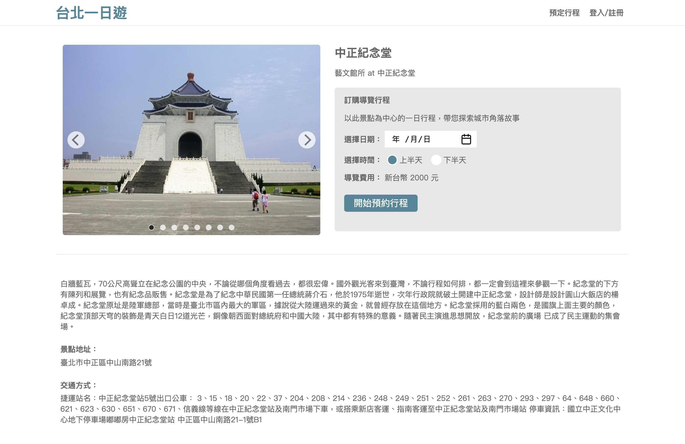
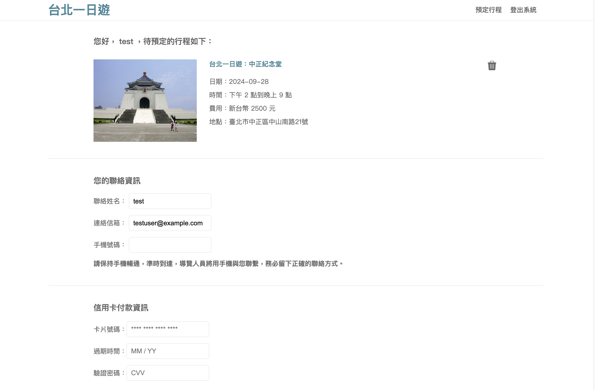
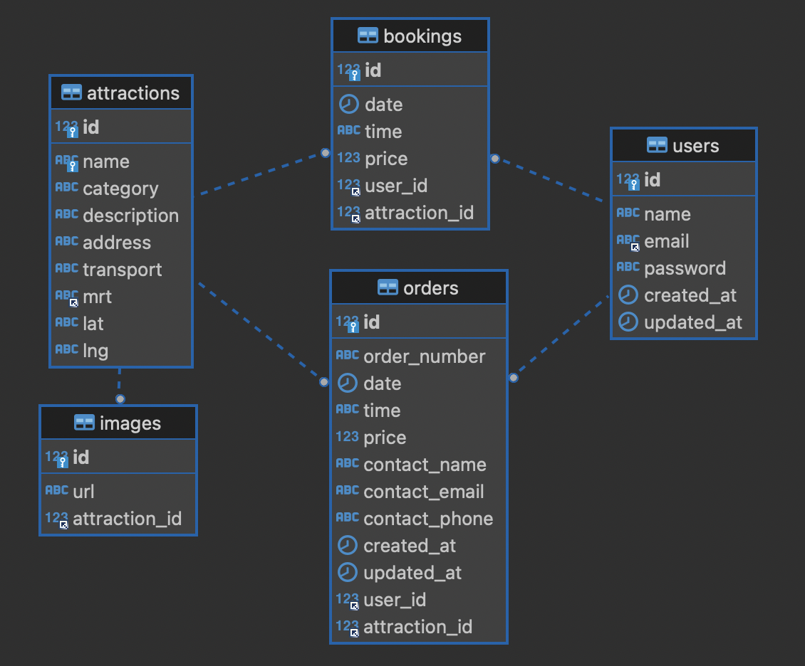

# Taipei Day Trip

Taipei Day Trip is an e-commerce platform for tourism, allowing users to discover and book day tours in Taipei City.

## Features

- **User Account**: Register or log in to access and manage your personal account.
- **Attraction Search**: Search for Taipei attractions and view detailed information using attraction names, MRT station names, or keywords.
- **Secure Payment**: Process transactions conveniently through TapPay.

## Tech Stack

- **Frontend**: HTML, CSS, JavaScript
- **Backend**: Python, FastAPI
- **Database**: MySQL
- **Version Control**: Git
- **Cloud Service**: AWS EC2

## Database Schema

